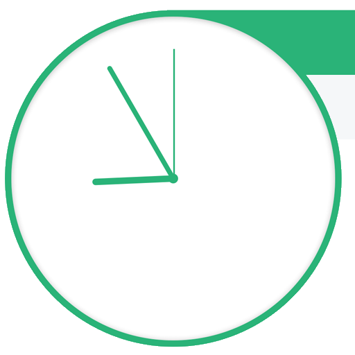

# Get Shit Done!

A simple personal project to plan out my day to get some structure back in my life after a year off [traveling]

https://whatworkwhen.netlify.com/ 

# Goals

* Get on track (by getting off track making this...)
* Learn more GitHub ✅
* Learn more about Vue.js and related frameworks
* Learn more about CD (using Netify) ✅

# TODO

* highlight current task ✅
* pull timing from schedule.json ✅
* make update (without a reload)
* make resizable
* add push notifications
* PWA
* OSX Notification Center Widget
* add social+meta
* add darkmode

