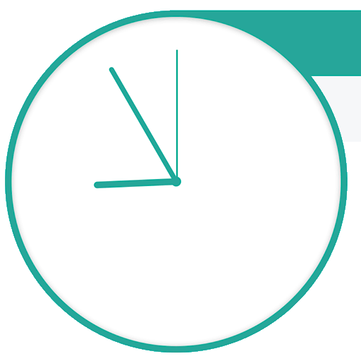

# Get Shit Done!

A simple personal project to plan out my day to get some structure back in my life after a year off [traveling]

https://whatworkwhen.netlify.com/

# Goals

- [ ] Get on track (by getting off track making this...)
- [x] Learn more GitHub
- [ ] Learn more about Vue.js and related frameworks
- [x] Learn more about CD (using Netify)

# TODO

- [x] highlight current task
- [x] pull timing from schedule.json
- [x] make update (without a reload)
- [x] make resizable
- [ ] add push notifications
- [x] PWA
- [ ] OSX Notification Center Widget
- [ ] add social+meta
- [x] add darkmode

